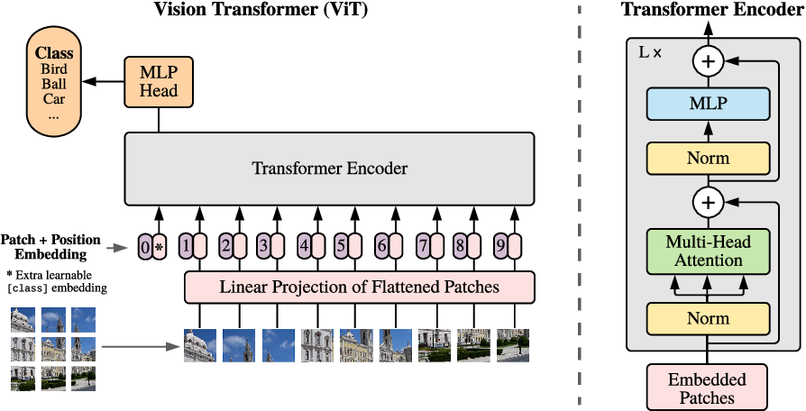
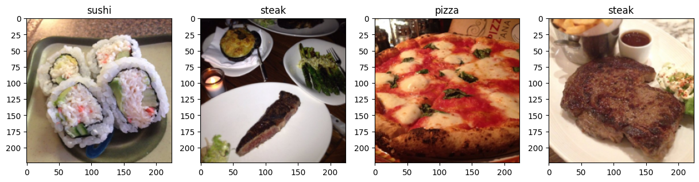
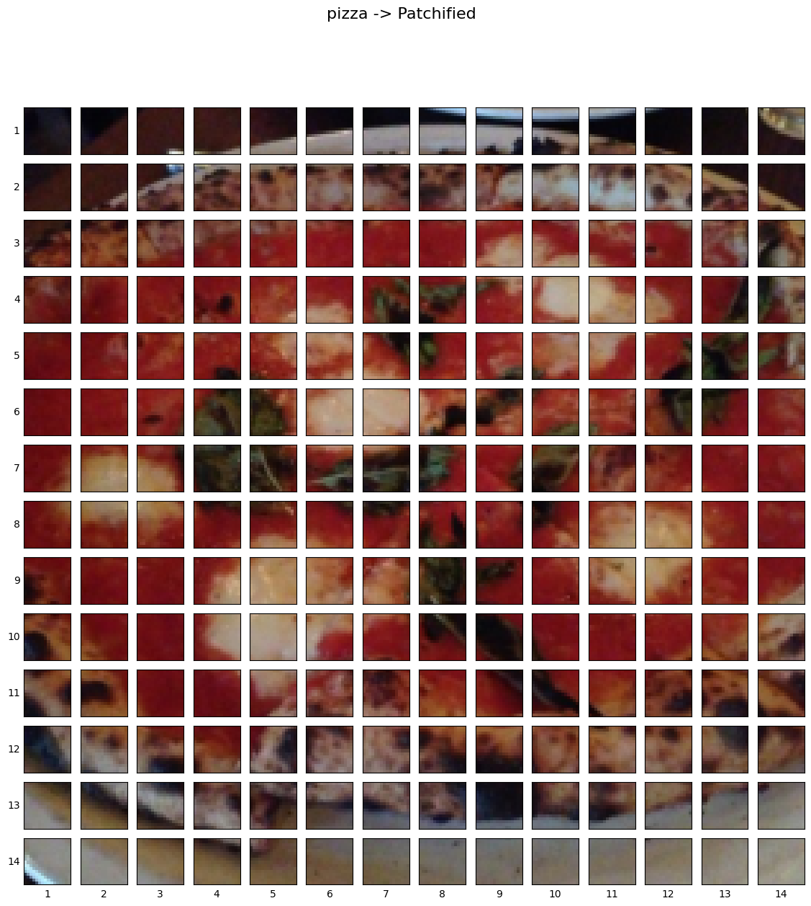

# Vision Transformer (ViT) based Food Classification 
After the amazing performance of transformer architecture in natural language processing tasks [Attention Is All You Need](https://arxiv.org/abs/1706.03762), it is used for image classification tasks recently. A team of Google consists of Alexey Dosovitskiy, Lucas Beyer, Alexander Kolesnikov, Dirk Weissenborn, Xiaohua Zhai, Thomas Unterthiner, Mostafa Dehghani, Matthias Minderer, Georg Heigold, Sylvain Gelly, Jakob Uszkoreit, Neil Houlsby complete the paper [An Image is Worth 16x16 Words: Transformers for Image Recognition at Scale](https://arxiv.org/abs/2010.11929) in 2020. Just like a sequence of words, a number of image patches are fed through the encoder block to obtain the feature. And finally Multi-layer perceptron (MLP) Head classifies the image. In this work, I used the Food-101 dataset which contains 101 classes, and implemented the Vision Transformer (ViT) model for classification. By using the pretrained model provided by Google and after proper training, the model obtained 91% classification accuracy.

### Project Overview
Food classification plays a vital role in various domains, such as nutrition analysis, dietary monitoring, and meal planning. Traditional approaches to food classification rely on handcrafted features or convolutional neural networks (CNNs). However, recent advancements in computer vision have introduced a new paradigm called Vision Transformers (ViTs), which have shown remarkable performance in image recognition tasks. This project aims to leverage the power of Vision Transformers for food classification tasks.<br>
For a sequence of words, the transformer has an encoder-decoder structure but for an image, we need only encode the block to extract the feature. And just like a sequence of words image can be divided into a number of patches and fed through the encoder. And the encoder will find self-attention among the patches. Finally, MLP-head will classify the image.
 <br>
Vision Transformer uses a standard Transformer encoder and fixed-size patches to achieve the State-of-the-Art (SOTA) task of image recognition. The author employs the conventional strategy of including an additional learnable "classification token" in the sequence in order to perform classification. In this project I follow several steps to complete the project and obtain better classification result.
- Data Collection and Observation
- Data Preprocessing
- Create the Model and Modify
- Observe the Test result

### Data Collection and Observation
The dataset I used in this project is  [Food-101](https://data.vision.ee.ethz.ch/cvl/datasets_extra/food-101/). It contains 101 classes with a total of 101'000 images. Some of the images are;


### Data Preprocessing
First task is to process and split the dataset for the experiments. The dataset format is: <br>
```python
     food-101
     .  images
     .      apple_pie
     .          all_images
     .      baby_back_ribs
     .          all_images
     .      .
     .      .
     .      waffles
     .          all_images 
```
<br> Run the python file to rearrange  the dataset as follows:  ```python rearrange.py```  <br>
```python
     food-101
     .  train
     .      apple_pie
     .          all_images
     .      baby_back_ribs
     .          all_images
     .      .
     .      .
     .      waffles
     .          all_images
     .  test
     .      apple_pie
     .          all_images
     .      baby_back_ribs
     .          all_images
     .      .
     .      .
     .      waffles
     .          all_images
          
```

### Create the Model and Modify
Vision Transformer follows the four equations to extract the image feature.
<br>
The initial image shape is (H×W×C) and after converting the image into patches it will be N×(PxP·C) where (P, P) is the resolution of each image patch and N is the number of patches.
#### Before
<br>
#### After converting into patches
<br>
#### Configs
According to the original paper of Vision Transformer:<br>
- ```image_size: 224.```<br>
Image size. If you have rectangular images, make sure your image size is the maximum of the width and height<br>
- ```patch_size: 16```<br>
Number of patches. image_size must be divisible by patch_size.<br>
- ```dim: 768.``` <br>
Last dimension of output tensor after linear transformation nn.Linear(..., dim).<br>
- ```depth: 12.```<br>
Number of Transformer blocks.<br>
- ```heads: 12. ```<br>
Number of heads in Multi-head Attention layer.<br>
- ```mlp_dim: 3072.```<br>
Dimension of the MLP (FeedForward) layer.<br>
- ```channels: int, default 3. ```<br>
Number of image's channels.<br>
- ```dropout: float between [0, 1], default 0. ```<br>
Dropout rate.<br>
- ```emb_dropout: float between [0, 1], default 0. ```<br>
Embedding dropout rate.<br>
- ``` Learning Rate: 3e-2``` <br>
Learning Rate to update the parameters


### Pre-trained model download (Google's Official Checkpoint)
There are many models available and in this work I use ViT-B_16(85.8M). [Available models](https://console.cloud.google.com/storage/vit_models/).
The path of pre-trained checkpoint must be added in the ```python train.py``` file <br>
<br> Run the python file to train the the model :  ```python train.py```  <br>

### Observe the Test result
The test accuracy is =          <br>


### Reference
- [Attention Is All You Need](https://arxiv.org/abs/1706.03762)
- [An Image is Worth 16x16 Words: Transformers for Image Recognition at Scale](https://arxiv.org/abs/2010.11929)
- [Google ViT](https://github.com/google-research/vision_transformer)
- [ViT-cifar](https://github.com/jeonsworld/ViT-pytorch)
- [ViT-ALL](https://github.com/lucidrains/vit-pytorch#vivit)
#### Citations
```bibtex
@article{vaswani2017attention,
  title={Attention is all you need},
  author={Vaswani, Ashish and Shazeer, Noam and Parmar, Niki and Uszkoreit, Jakob and Jones, Llion and Gomez, Aidan N and Kaiser, {\L}ukasz and Polosukhin, Illia},
  journal={Advances in neural information processing systems},
  volume={30},
  year={2017}
}
```
```bibtex
@article{dosovitskiy2020,
  title={An Image is Worth 16x16 Words: Transformers for Image Recognition at Scale},
  author={Dosovitskiy, Alexey and Beyer, Lucas and Kolesnikov, Alexander and Weissenborn, Dirk and Zhai, Xiaohua and Unterthiner, Thomas and  Dehghani, Mostafa and Minderer, Matthias and Heigold, Georg and Gelly, Sylvain and Uszkoreit, Jakob and Houlsby, Neil},
  journal={arXiv preprint arXiv:2010.11929},
  year={2020}
}
```

```bibtex
@inproceedings{bossard14,
  title = {Food-101 -- Mining Discriminative Components with Random Forests},
  author = {Bossard, Lukas and Guillaumin, Matthieu and Van Gool, Luc},
  booktitle = {European Conference on Computer Vision},
  year = {2014}
}

```
